# 🏗️ RCNA Stack

<table border="0" cellpadding="8" cellspacing="0">
  <tr>
    <td valign="middle" align="center">
      
    </td>
    <td valign="middle">
      RCNA is a reference Kubernetes-first Cloud Native platform architecture
    </td>
  </tr>
</table>

RCNA (Reference Cloud Native Architecture) replaces Helm with CDK8s stacks that generate Kubernetes resources from typed code, 
backed by a custom CDK8s-to-CDKTN integration library ([`sumicare_cdktn_cdks8`](./packages/libs/sumicare_cdktn_cdks8/)) that provides both a provider (cdk8s -> CDKTN) and a resolver (CDKTN -> cdk8s) to bridge infrastructure and application synthesis. 
This gives the platform a single maintained contract for how all components behave instead of loosely coupled chart templates.

## 📦 Stack Catalog

### 🖥️ Compute Stack

Autoscaling, resource optimization, and workload scheduling.

<table border="0" cellpadding="8" cellspacing="0">
  <tr>
    <td valign="middle" align="center">
      
    </td>
    <td valign="middle">
      <a href="./packages/stacks/sumicare_compute_stack/charts/sumicare_descheduler_chart/">Descheduler</a> - evicts pods for better node utilization
    </td>
  </tr>
  <tr>
    <td valign="middle" align="center">
      
    </td>
    <td valign="middle">
      <a href="./packages/stacks/sumicare_compute_stack/charts/sumicare_goldilocks_chart/">Goldilocks</a> - VPA-based resource request recommendations
    </td>
  </tr>
  <tr>
    <td valign="middle" align="center">
      <a href="https://github.com/clastix/kamaji">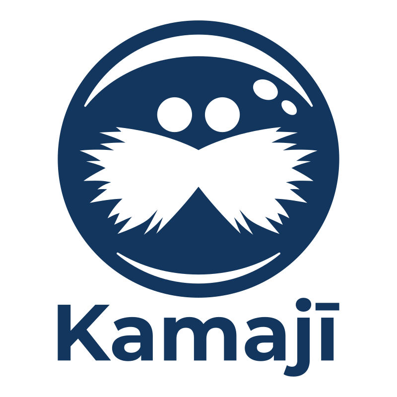</a>
    </td>
    <td valign="middle">
      <a href="./packages/stacks/sumicare_compute_stack/charts/sumicare_kamaji_chart/">Kamaji</a> - hosted control plane manager for Kubernetes
    </td>
  </tr>
  <tr>
    <td valign="middle" align="center">
      
    </td>
    <td valign="middle">
      <a href="./packages/stacks/sumicare_compute_stack/charts/sumicare_keda_chart/">KEDA</a> - event-driven autoscaling (scale-to-zero)
    </td>
  </tr>
  <tr>
    <td valign="middle" align="center">
      
    </td>
    <td valign="middle">
      <a href="./packages/stacks/sumicare_compute_stack/charts/sumicare_vpa_chart/">VPA</a> - vertical pod autoscaling
    </td>
  </tr>
</table>

### 🛠️ Development Stack

CI/CD, source control, and cloud IDE infrastructure.

<table border="0" cellpadding="8" cellspacing="0">
  <tr>
    <td valign="middle" align="center">
      
    </td>
    <td valign="middle">
      <a href="./packages/stacks/sumicare_development_stack/charts/sumicare_dex_chart/">Dex</a> - federated OIDC identity provider
    </td>
  </tr>
  <tr>
    <td valign="middle" align="center">
      
    </td>
    <td valign="middle">
      <a href="./packages/stacks/sumicare_development_stack/charts/sumicare_forgejo_chart/">Forgejo</a> - community-governed git forge
    </td>
  </tr>
  <tr>
    <td valign="middle" align="center">
      <a href="https://tekton.dev">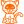</a>
    </td>
    <td valign="middle">
      <a href="./packages/stacks/sumicare_development_stack/charts/sumicare_tektoncd_stack/">TektonCD</a> - Kubernetes-native CI/CD framework
      <ul>
        <li><a href="./packages/stacks/sumicare_development_stack/charts/sumicare_tektoncd_stack/charts/sumicare_chart_tektoncd_chains/">Chains</a> - supply chain security signing</li>
        <li><a href="./packages/stacks/sumicare_development_stack/charts/sumicare_tektoncd_stack/charts/sumicare_chart_tektoncd_dashboard/">Dashboard</a> - web UI for Tekton</li>
        <li><a href="./packages/stacks/sumicare_development_stack/charts/sumicare_tektoncd_stack/charts/sumicare_chart_tektoncd_pipeline/">Pipeline</a> - core pipeline CRDs</li>
        <li><a href="./packages/stacks/sumicare_development_stack/charts/sumicare_tektoncd_stack/charts/sumicare_chart_tektoncd_results/">Results</a> - pipeline result persistence</li>
        <li><a href="./packages/stacks/sumicare_development_stack/charts/sumicare_tektoncd_stack/charts/sumicare_chart_tektoncd_triggers/">Triggers</a> - event-triggered pipeline execution</li>
      </ul>
    </td>
  </tr>
  <tr>
    <td valign="middle" align="center">
      
    </td>
    <td valign="middle">
      <a href="./packages/stacks/sumicare_development_stack/charts/sumicare_theia_stack/">Eclipse Theia</a> - cloud IDE deployment framework
      <ul>
        <li><a href="./packages/stacks/sumicare_development_stack/charts/sumicare_theia_stack/charts/sumicare_chart_theia_cloud/">Theia Cloud</a> - cloud IDE sessions</li>
        <li><a href="./packages/stacks/sumicare_development_stack/charts/sumicare_theia_stack/charts/sumicare_chart_theia_operator/">Theia Operator</a> - IDE operator</li>
      </ul>
    </td>
  </tr>
</table>

### 💰 FinOps Stack

Cost monitoring and cloud spend optimization.

<table border="0" cellpadding="8" cellspacing="0">
  <tr>
    <td valign="middle" align="center">
      <a href="https://cloudcustodian.io">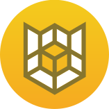</a>
    </td>
    <td valign="middle">
      <a href="./packages/stacks/sumicare_finops_stack/charts/sumicare_custodian_stack/">Cloud Custodian</a> - rules engine for cost and compliance
    </td>
  </tr>
  <tr>
    <td valign="middle" align="center">
      <a href="https://www.opencost.io">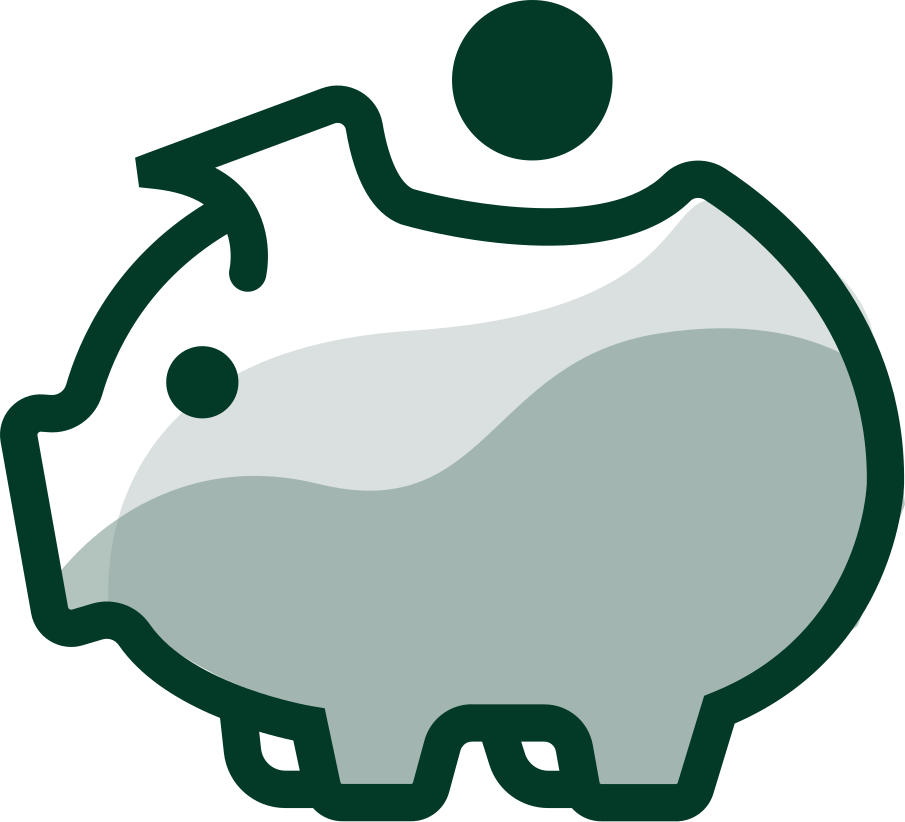</a>
    </td>
    <td valign="middle">
      <a href="./packages/stacks/sumicare_finops_stack/charts/sumicare_opencost_stack/">OpenCost</a> - real-time Kubernetes cost allocation
    </td>
  </tr>
</table>

### 🚀 GitOps Stack

Declarative continuous delivery, progressive deployment, and workflow automation.

<table border="0" cellpadding="8" cellspacing="0">
  <tr>
    <td rowspan="4" valign="middle" align="center">
      
    </td>
    <td valign="middle">
      <a href="./packages/stacks/sumicare_gitops_stack/charts/sumicare_argocd_stack/">Argo CD</a> - declarative GitOps CD
      <ul>
        <li><a href="./packages/stacks/sumicare_gitops_stack/charts/sumicare_argocd_stack/charts/sumicare_chart_argocd/">Argo CD Core</a> - main Argo CD controller</li>
        <li><a href="./packages/stacks/sumicare_gitops_stack/charts/sumicare_argocd_stack/charts/sumicare_chart_argocd_images/">Argo CD Image Updater</a> - automatic image tag updates</li>
      </ul>
    </td>
  </tr>
  <tr>
    <td valign="middle">
      <a href="./packages/stacks/sumicare_gitops_stack/charts/sumicare_argo_events_chart/">Argo Events</a> - event-driven workflow automation
    </td>
  </tr>
  <tr>
    <td valign="middle">
      <a href="./packages/stacks/sumicare_gitops_stack/charts/sumicare_argo_rollouts_chart/">Argo Rollouts</a> - progressive delivery (canary, blue-green)
    </td>
  </tr>
  <tr>
    <td valign="middle">
      <a href="./packages/stacks/sumicare_gitops_stack/charts/sumicare_argo_workflows_chart/">Argo Workflows</a> - Kubernetes-native workflow engine
    </td>
  </tr>
</table>

### 📡 Data Stack

Event streaming, pub/sub messaging, and event-driven communication.

<table border="0" cellpadding="8" cellspacing="0">
  <tr>
    <td valign="middle" align="center">
      
    </td>
    <td valign="middle">
      <a href="./packages/stacks/sumicare_data_stack/charts/sumicare_data_fusion_ballista_chart/">Ballista</a> - distributed SQL query engine
    </td>
  </tr>
  <tr>
    <td valign="middle" align="center">
      <a href="https://nats.io">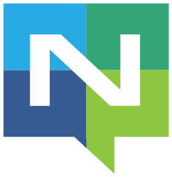</a>
    </td>
    <td valign="middle">
      <a href="./packages/stacks/sumicare_data_stack/charts/sumicare_nats_chart/">NATS</a> - high-performance messaging with JetStream
    </td>
  </tr>
  <tr>
    <td valign="middle" align="center">
      <a href="https://strimzi.io">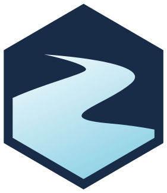</a>
    </td>
    <td valign="middle">
      <a href="./packages/stacks/sumicare_data_stack/charts/sumicare_strimzi_chart/">Strimzi</a> - Kafka operator for Kubernetes
    </td>
  </tr>
</table>

### 🧠 MLOps Stack

LLM serving, distributed training, GPU scheduling, and model lifecycle management.

<table border="0" cellpadding="8" cellspacing="0">
  <tr>
    <td valign="middle" align="center">
      
    </td>
    <td valign="middle">
      <a href="./packages/stacks/sumicare_mlops_stack/charts/sumicare_agent_gateway_stack/">agentgateway</a> - agentic proxy for AI agents and MCP servers
    </td>
  </tr>
  <tr>
    <td valign="middle" align="center">
      
    </td>
    <td valign="middle">
      <a href="./packages/stacks/sumicare_mlops_stack/charts/sumicare_agent_registry_stack/">agentregistry</a> - centralized registry for AI agents, skills, and MCP servers
    </td>
  </tr>
  <tr>
    <td valign="middle" align="center">
      
    </td>
    <td valign="middle">
      <a href="./packages/stacks/sumicare_mlops_stack/charts/sumicare_kagent_stack/">kagent</a> - cloud native agentic AI platform for Kubernetes
    </td>
  </tr>
  <tr>
    <td valign="middle" align="center">
      
    </td>
    <td valign="middle">
      <a href="./packages/stacks/sumicare_mlops_stack/charts/sumicare_kuberay_chart/">KubeRay</a> - Ray operator for Kubernetes
    </td>
  </tr>
  <tr>
    <td valign="middle" align="center">
      
    </td>
    <td valign="middle">
      <a href="./packages/stacks/sumicare_mlops_stack/charts/sumicare_llm_d_chart/">llm-d</a> - distributed LLM inference serving
    </td>
  </tr>
  <tr>
    <td valign="middle" align="center">
      
    </td>
    <td valign="middle">
      <a href="./packages/stacks/sumicare_mlops_stack/charts/sumicare_nats_chart/">NATS</a> - messaging for ML workloads
    </td>
  </tr>
  <tr>
    <td valign="middle" align="center">
      <a href="https://github.com/ome-projects/ome">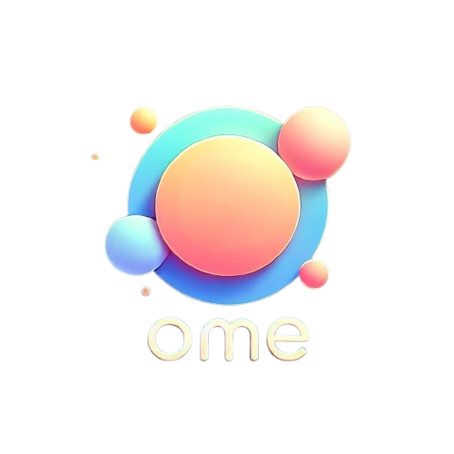</a>
    </td>
    <td valign="middle">
      <a href="./packages/stacks/sumicare_mlops_stack/charts/sumicare_ome_chart/">OME</a> - Kubernetes operator for LLM serving
    </td>
  </tr>
  <tr>
    <td valign="middle" align="center">
      
    </td>
    <td valign="middle">
      <a href="./packages/stacks/sumicare_mlops_stack/charts/sumicare_sglang_chart/">SGLang</a> - high-throughput LLM inference engine
    </td>
  </tr>
  <tr>
    <td valign="middle" align="center">
      
    </td>
    <td valign="middle">
      <a href="./packages/stacks/sumicare_mlops_stack/charts/sumicare_vllm_chart/">vLLM</a> - PagedAttention LLM inference
    </td>
  </tr>
  <tr>
    <td valign="middle" align="center">
      
    </td>
    <td valign="middle">
      <a href="./packages/stacks/sumicare_mlops_stack/charts/sumicare_volcano_chart/">Volcano</a> - batch scheduling for HPC and ML
    </td>
  </tr>
</table>

### 🌐 Networking Stack

CNI, service mesh, DNS management, and network policy enforcement.

<table border="0" cellpadding="8" cellspacing="0">
  <tr>
    <td valign="middle" align="center">
      
    </td>
    <td valign="middle">
      <a href="./packages/stacks/sumicare_networking_stack/charts/sumicare_cilium_chart/">Cilium</a> - eBPF-based CNI with Hubble observability
    </td>
  </tr>
  <tr>
    <td valign="middle" align="center">
      
    </td>
    <td valign="middle">
      <a href="./packages/stacks/sumicare_networking_stack/charts/sumicare_external-dns_chart/">ExternalDNS</a> - DNS record sync from K8s resources
    </td>
  </tr>
  <tr>
    <td valign="middle" align="center">
      
    </td>
    <td valign="middle">
      <a href="./packages/stacks/sumicare_networking_stack/charts/sumicare_istio_stack/">Istio</a> - service mesh with traffic management, security, and observability
    </td>
  </tr>
  <tr>
    <td valign="middle" align="center">
      
    </td>
    <td valign="middle">
      <a href="./packages/stacks/sumicare_networking_stack/charts/sumicare_netbird_stack/">NetBird</a> - WireGuard®-based zero trust overlay network with SSO and access controls
    </td>
  </tr>
  <tr>
    <td valign="middle" align="center">
      <a href="https://kgateway.dev">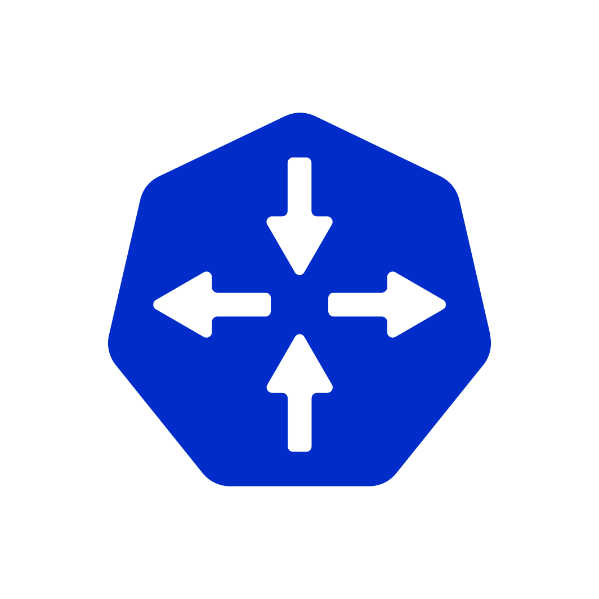</a>
    </td>
    <td valign="middle">
      <a href="./packages/stacks/sumicare_networking_stack/charts/sumicare_kgateway_stack/">kgateway</a> - cloud-native API gateway built on Envoy
    </td>
  </tr>
</table>

### 📊 Observability Stack

Metrics, logs, traces, and profiling collection with visualization.

<table border="0" cellpadding="8" cellspacing="0">
  <tr>
    <td valign="middle" align="center">
      
    </td>
    <td valign="middle">
      <a href="./packages/stacks/sumicare_observability_stack/charts/sumicare_alloy_chart/">Alloy</a> - OpenTelemetry collector distribution
    </td>
  </tr>
  <tr>
    <td valign="middle" align="center">
      
    </td>
    <td valign="middle">
      <a href="./packages/stacks/sumicare_observability_stack/charts/sumicare_grafana_chart/">Grafana</a> - visualization and dashboards
    </td>
  </tr>
  <tr>
    <td valign="middle" align="center">
      
    </td>
    <td valign="middle">
      <a href="./packages/stacks/sumicare_observability_stack/charts/sumicare_grafana-mcp_chart/">Grafana MCP</a> - MCP server for Grafana
    </td>
  </tr>
  <tr>
    <td valign="middle" align="center">
      <a href="https://github.com/grafana/k6-operator">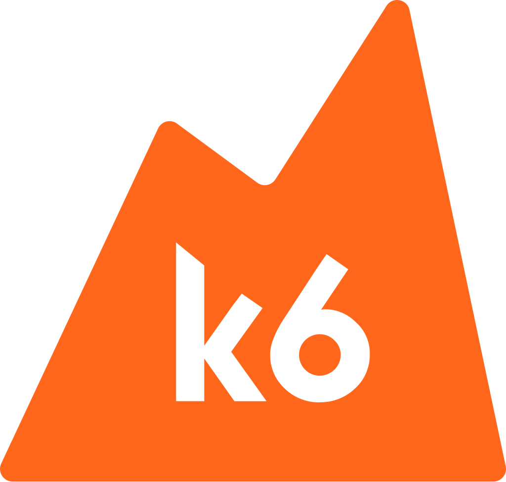</a>
    </td>
    <td valign="middle">
      <a href="./packages/stacks/sumicare_observability_stack/charts/sumicare_k6_chart/">k6</a> - load testing and performance validation
    </td>
  </tr>
  <tr>
    <td valign="middle" align="center">
      <a href="https://github.com/kite-org/kite">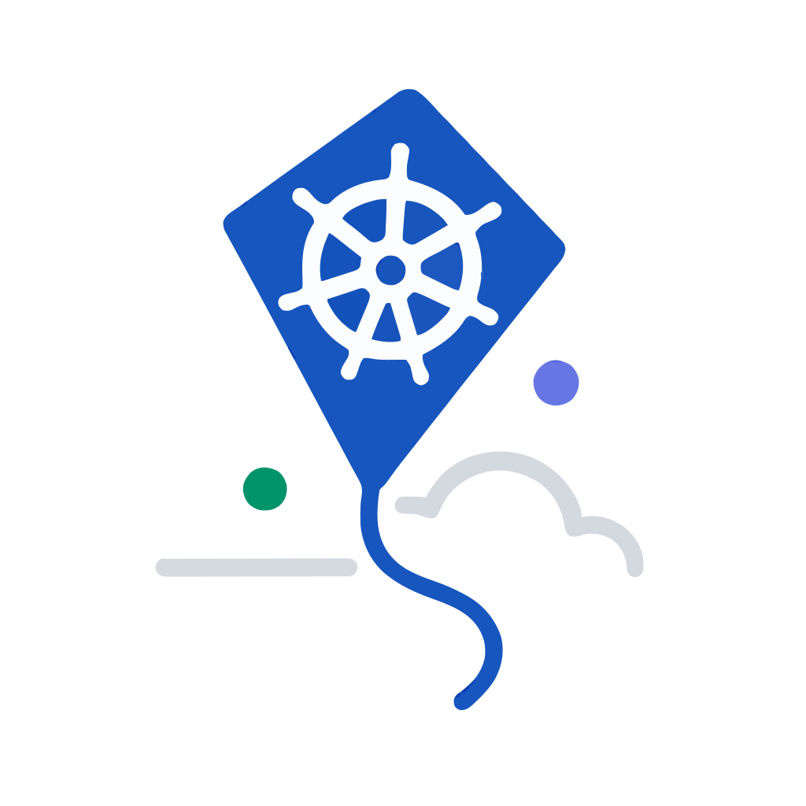</a>
    </td>
    <td valign="middle">
      <a href="./packages/stacks/sumicare_observability_stack/charts/sumicare_kite_chart/">Kite</a> - observability companion
    </td>
  </tr>
  <tr>
    <td valign="middle" align="center">
      
    </td>
    <td valign="middle">
      <a href="./packages/stacks/sumicare_observability_stack/charts/sumicare_loki_chart/">Loki</a> - log aggregation system
    </td>
  </tr>
  <tr>
    <td valign="middle" align="center">
      <a href="https://grafana.com/docs/mimir">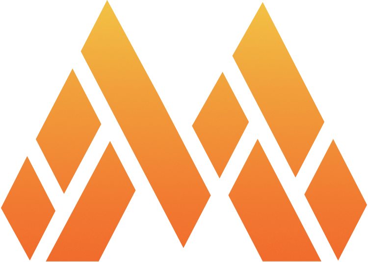</a>
    </td>
    <td valign="middle">
      <a href="./packages/stacks/sumicare_observability_stack/charts/sumicare_mimir_chart/">Mimir</a> - Prometheus-compatible metrics backend
    </td>
  </tr>
  <tr>
    <td valign="middle" align="center">
      
    </td>
    <td valign="middle">
      <a href="./packages/stacks/sumicare_observability_stack/charts/sumicare_prometheus_chart/">Prometheus</a> - monitoring and alerting
    </td>
  </tr>
  <tr>
    <td valign="middle" align="center">
      
    </td>
    <td valign="middle">
      <a href="./packages/stacks/sumicare_observability_stack/charts/sumicare_pyroscope_chart/">Pyroscope</a> - continuous profiling database
    </td>
  </tr>
  <tr>
    <td valign="middle" align="center">
      
    </td>
    <td valign="middle">
      <a href="./packages/stacks/sumicare_observability_stack/charts/sumicare_tempo_chart/">Tempo</a> - distributed tracing backend
    </td>
  </tr>
</table>

### 🔒 Security Stack

Secrets management, PKI, secrets injection, CSI integration, policy enforcement, and runtime security.

<table border="0" cellpadding="8" cellspacing="0">
  <tr>
    <td valign="middle" align="center">
      <a href="https://openbao.org">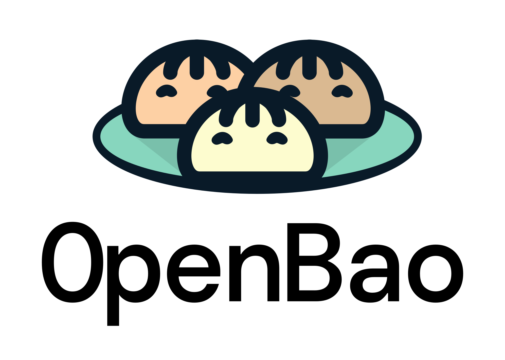</a>
    </td>
    <td valign="middle">
      <a href="./packages/stacks/sumicare_security_stack/charts/sumicare_openbao_stack/">OpenBao</a> - open source secrets management with deeply integrated PKI
      <ul>
        <li><a href="./packages/stacks/sumicare_security_stack/charts/sumicare_openbao_stack/src/charts/sumicare_openbao_server/">Server</a> - HA secrets backend (StatefulSet with integrated raft storage)</li>
        <li><a href="./packages/stacks/sumicare_security_stack/charts/sumicare_openbao_stack/src/charts/sumicare_openbao_injector/">Injector</a> - mutating webhook for sidecar agent injection (replaces <a href="https://cert-manager.io/">cert-manager</a>)</li>
        <li><a href="./packages/stacks/sumicare_security_stack/charts/sumicare_openbao_stack/src/charts/sumicare_openbao_csi/">CSI Provider</a> - Secrets Store CSI driver integration for volume-mounted secrets</li>
        <li><a href="./packages/stacks/sumicare_security_stack/charts/sumicare_openbao_stack/src/charts/sumicare_openbao_snapshot/">Snapshot Agent</a> - periodic raft snapshots to S3</li>
      </ul>
    </td>
  </tr>
  <tr>
    <td valign="middle" align="center">
      <a href="https://falco.org">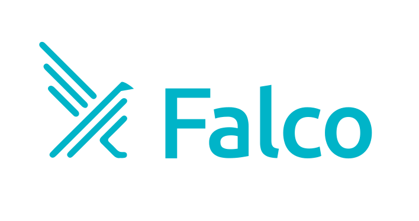</a>
    </td>
    <td valign="middle">
      <a href="./packages/stacks/sumicare_security_stack/charts/sumicare_falco_chart/">Falco</a> - cloud native runtime security
    </td>
  </tr>
  <tr>
    <td valign="middle" align="center">
      
    </td>
    <td valign="middle">
      <a href="./packages/stacks/sumicare_security_stack/charts/sumicare_kubearmor_chart/">KubeArmor</a> - runtime security enforcement
    </td>
  </tr>
  <tr>
    <td valign="middle" align="center">
      <a href="https://kyverno.io">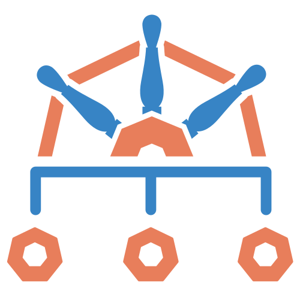</a>
    </td>
    <td valign="middle">
      <a href="./packages/stacks/sumicare_security_stack/charts/sumicare_kyverno_chart/">Kyverno</a> - Kubernetes policy engine
    </td>
  </tr>
  <tr>
    <td valign="middle" align="center">
      <a href="https://openfga.dev">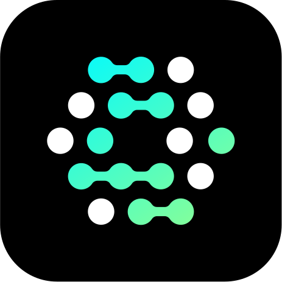</a>
    </td>
    <td valign="middle">
      <a href="./packages/stacks/sumicare_security_stack/charts/sumicare_openfga_chart/">OpenFGA</a> - relationship-based access control
    </td>
  </tr>
  <tr>
    <td valign="middle" align="center">
      <a href="https://github.com/stakater/Reloader">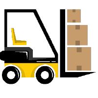</a>
    </td>
    <td valign="middle">
      <a href="./packages/stacks/sumicare_security_stack/charts/sumicare_reloader_chart/">Reloader</a> - automatic pod restarts on secret changes
    </td>
  </tr>
</table>

### 💾 Storage Stack

Persistent volume management, object storage, database operators, and backup/restore.

<table border="0" cellpadding="8" cellspacing="0">
  <tr>
    <td valign="middle" align="center">
      
    </td>
    <td valign="middle">
      <a href="./packages/stacks/sumicare_storage_stack/charts/sumicare_cnpg_chart/">CloudNativePG</a> - PostgreSQL operator
    </td>
  </tr>
    <tr>
    <td valign="middle" align="center">
      
    </td>
    <td valign="middle">
      <a href="./packages/stacks/sumicare_storage_stack/charts/sumicare_rook_stack/">Rook</a> - cloud-native storage orchestrator
    </td>
  </tr>
  <tr>
    <td valign="middle" align="center">
      
    </td>
    <td valign="middle">
      <a href="./packages/stacks/sumicare_storage_stack/charts/sumicare_ceph_stack/">Ceph</a> - distributed storage system
    </td>
  </tr>
  <tr>
    <td valign="middle" align="center">
      
    </td>
    <td valign="middle">
      <a href="./packages/stacks/sumicare_storage_stack/charts/sumicare_garage_chart/">Garage</a> - S3-compatible object storage
    </td>
  </tr>
  <tr>
    <td valign="middle" align="center">
      <a href="https://github.com/rancher/local-path-provisioner">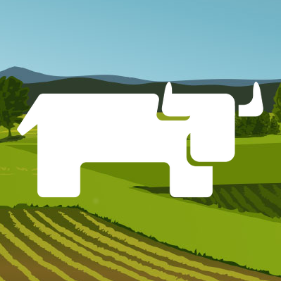</a>
    </td>
    <td valign="middle">
      <a href="./packages/stacks/sumicare_storage_stack/charts/sumicare_local_path_provisioner_chart/">Local Path Provisioner</a> - local storage provisioning
    </td>
  </tr>
  <tr>
    <td valign="middle" align="center">
      
    </td>
    <td valign="middle">
      <a href="./packages/stacks/sumicare_storage_stack/charts/sumicare_pvc_autoresizer_chart/">PVC Autoresizer</a> - automatic PVC resizing
    </td>
  </tr>

  <tr>
    <td valign="middle" align="center">
      <a href="https://github.com/topolvm/topolvm">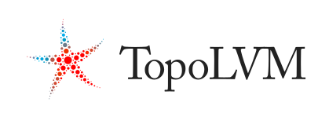</a>
    </td>
    <td valign="middle">
      <a href="./packages/stacks/sumicare_storage_stack/charts/sumicare_topolvm_chart/">TopoLVM</a> - LVM-based CSI driver
    </td>
  </tr>
  <tr>
    <td valign="middle" align="center">
      
    </td>
    <td valign="middle">
      <a href="./packages/stacks/sumicare_storage_stack/charts/sumicare_valkey_operator_chart/">Valkey Operator</a> - Redis-compatible key-value operator
    </td>
  </tr>
  <tr>
    <td valign="middle" align="center">
      
    </td>
    <td valign="middle">
      <a href="./packages/stacks/sumicare_storage_stack/charts/sumicare_velero_chart/">Velero</a> - backup and disaster recovery
    </td>
  </tr>
</table>

## 🧩 Supporting Services

`sumicare_rules` services complement the RCNA stacks with platform integration, automation, and landing zone management. The service structure is under active development and may change.

  - [Backstage](./packages/services/sumicare_backstage/) - developer portal and service catalog
  - [Agents](./packages/services/sumicare_agents/) - AI agent integrations for platform engineering and development workflows
  - [Organization](./packages/services/sumicare_organization/) - AWS Organization and Control Tower account lifecycle management 
    (replaces [AfT](https://github.com/aws-ia/terraform-aws-control_tower_account_factory))
  - [GitOps](./packages/services/sumicare_gitops/) - GitOps continuous delivery and Kubernetes state reconciliation
  - [FinOps](./packages/services/sumicare_finops/) - cloud financial operations and cost management
  - [K8s Cluster Manager](./packages/services/sumicare_k8s_cluster_manager/) - cluster audit, RBAC, admission, and runtime policy
  - [Office Worker](./packages/services/sumicare_office_pod/) - local development environments and shared Bazel worker pools on Office Machines
  - [Documentation](./packages/services/sumicare_documentation/) - platform documentation

## 📚 Contrib Libraries

Reusable libraries:

  - [cdktn_cdk8s](./packages/libs/sumicare_cdktn_cdks8/) - bidirectional cdk8s <-> CDKTN integration (provider + resolver)
  - [aqua_to_bazel_toolchain](./packages/libs/sumicare_aqua_to_bazel_toolchain/) - Aqua package manager toolchain derivation

---

## ⚖️ Disclaimer

All product names, marks, graphic material, and brands referenced in this documentation are the property of
their respective owners. Their use here is for identification and reference only and does not imply
endorsement or affiliation. Sumicare is not affiliated with, endorsed by, or sponsored by any upstream project
or its governing foundation unless explicitly stated.

This is a non-commercial project. Limited commercial support (deployment assistance, consulting, and
maintenance) may be offered case by case; such services do not constitute a commercial license of the
software, which remains freely available under the MIT License. The SGLang graphic material
(CC BY-NC-ND 4.0) is not used in any commercial-facing context.

## 🏷️ Attribution

> The Grafana Labs Marks (Grafana®, Loki®, Mimir™, Pyroscope™, Tempo™, k6®, Grafana Alloy™) are trademarks of Raintank, Inc. dba Grafana Labs, and are used with Grafana Labs' permission. We are not affiliated with, endorsed or sponsored by Grafana Labs or its affiliates. Use of these marks is subject to the [Grafana Labs Trademark Usage Policy](https://grafana.com/trademark-policy/).

> CNCF and the CNCF logo design are registered trademarks of the Cloud Native Computing Foundation. Argo®, Cilium®, Cloud Custodian®, Istio®, Kubernetes®, Keda®, KubeArmor®, Kyverno®, Prometheus®, and Rook® are registered trademarks of The Linux Foundation. cdk8s™, kgateway™, NATS™, and Tekton™ are trademarks of The Linux Foundation. Backstage® is a registered trademark of The Linux Foundation. Falco is a CNCF graduated project. OpenTofu is a CNCF-hosted project. Use of these marks is subject to the [Linux Foundation Trademark Usage Guidelines](https://www.linuxfoundation.org/legal/trademark-usage).

> Valkey™, Velero™, and Volcano™ are trademarks of LF Projects, LLC. OpenBao, Strimzi, and CloudNativePG are projects of LF Projects, LLC. Use of these marks is subject to the [LF Projects Trademark Policy](https://lfprojects.org/policies/).

> Eclipse Theia™ is a trademark of the Eclipse Foundation AISBL. Graphic material cannot be modified without the advanced written permission of Eclipse. First and most prominent reference must be "Eclipse Theia". Use is subject to the [Eclipse Foundation Trademark Usage Policy](https://www.eclipse.org/legal/logo-guidelines/).

> Apache Arrow and Apache are trademarks of the Apache Software Foundation. Use of these marks is subject to the [ASF Trademark Policy](https://apache.org/foundation/marks/).

> PostgreSQL and the Slonik Logo are trademarks or registered trademarks of the PostgreSQL Community Association of Canada, used with permission. Use is subject to the [PostgreSQL Trademark Policy](https://www.postgresql.org/about/policies/trademarks/).

> Redis is a registered trademark of Redis Ltd. See also: [Redis Trademarks](https://redis.io/legal/trademark-policy/).

> Ceph is a trademark of Red Hat, Inc. or its subsidiaries. Use is subject to the [Ceph Trademark Policy](https://ceph.io/en/trademarks/).

> NVIDIA and NeMo are trademarks of NVIDIA Corporation. Use is subject to the [NVIDIA Logos & Brand Guidelines](https://www.nvidia.com/en-us/about-nvidia/legal-info/logo-brand-usage/).

> The OpenBao artwork is © OpenBao a Series of LF Projects, LLC, licensed under [CC BY 4.0](https://creativecommons.org/licenses/by/4.0/).

> The Forgejo graphic material is © Cesar Schinas, licensed under [CC BY-SA 4.0](https://creativecommons.org/licenses/by-sa/4.0/).

> The SGLang graphic material is © 2023-2024 SGLang Team, licensed under [CC BY-NC-ND 4.0](https://creativecommons.org/licenses/by-nc-nd/4.0/). Non-commercial use only. No derivatives.

> cert-manager is a project of the Cloud Native Computing Foundation. Use of this mark is subject to the [Linux Foundation Trademark Usage Guidelines](https://www.linuxfoundation.org/legal/trademark-usage).

> Local Path Provisioner is a project of Rancher (SUSE LLC). Local Path Provisioner does not have a dedicated logo at the time of writing; the Rancher logo (a trademark of SUSE LLC) is used for identification only. Use is subject to the [SUSE Legal & Terms of Use](https://www.suse.com/company/legal/terms-of-use/).

> The following projects' graphic material is not separately licensed and is governed solely by the respective software license: agentgateway, agentregistry, Dex, Falco, Goldilocks, kagent, Kamaji, Kite, KubeRay, llm-d, NetBird, OME, PVC Autoresizer, Reloader, and TopoLVM. Apache 2.0 §6 and BSD-3-Clause do not grant trademark rights.

> WireGuard® and the WireGuard logo are registered trademarks of Jason A. Donenfeld. Use is subject to the [WireGuard Trademark Policy](https://www.wireguard.com/trademark-policy/). NetBird uses WireGuard® as its underlying transport protocol.

> Garage is licensed under AGPLv3. AGPLv3 does not grant trademark rights.

> vLLM graphic material has no explicit license file, at the moment of writing. ([#5](https://github.com/vllm-project/media-kit/issues/5))

> CDK Terrain (CDKTN) is a community fork of the Cloud Development Kit for Terraform (CDKTF), stewarded by the [Open Construct Foundation](https://the-ocf.org). CDKTN is licensed under [MPL-2.0](https://github.com/open-constructs/cdk-terrain/blob/main/LICENSE). The project was renamed from CDKTF to CDKTN due to trademark considerations. MPL-2.0 does not grant trademark rights.
